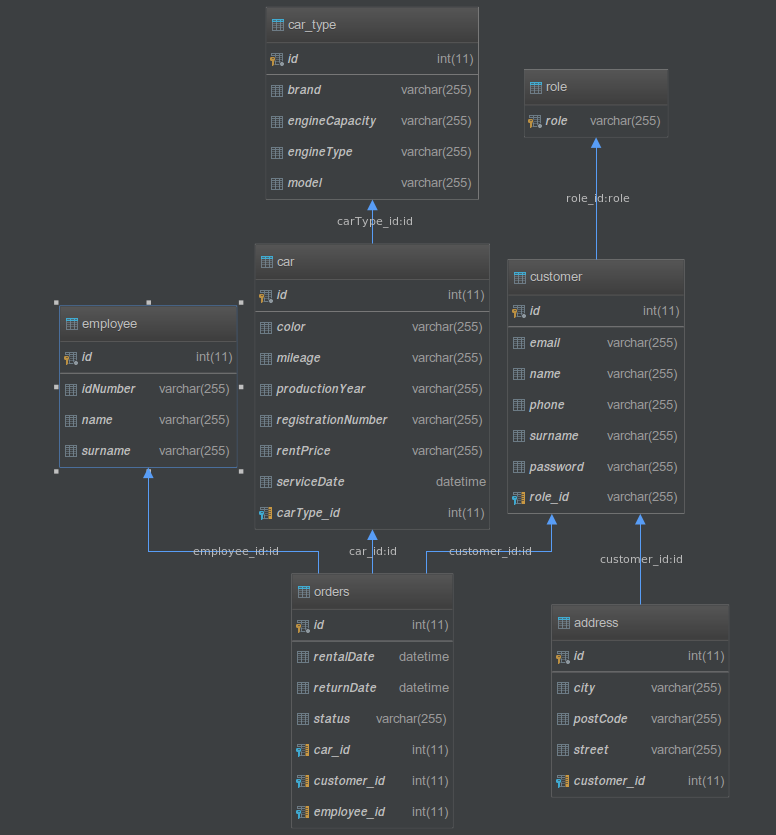

# Car Rental

Aplikacja jest zrobiona na potrzeby wypożyczalni samochodów.
Umożliwia stworzenie użytkownika – w tym celu musi on uzupełnić formularz rejestracyjny 
w odpowiedniej zakładce (dane wprowadzane do formularza są sprawdzane pod kątem poprawności). 
Zarejestrowany użytkownik może zalogować się do serwisu poprzez użycie swojego imienia lub 
adresu mailowego i podanie odpowiedniego hasła. Dopiero po zalogowaniu użytkownik może 
wypożyczyć samochód. W tym celu przechodzi w odpowiednią zakładkę i odszukuje na liście 
interesujący go pojazd, a następnie w kolejnej podstronie wybiera okres na jaki chce go 
wypożyczyć i zatwierdza wypożyczenie. Do sprawdzania akutalnych wypożyczeń służy osobna 
zakładka, na której możemy zobaczyć szczegółowe informacje na ich temat. 
Wśród technologii wykorzystanych w projekcie najwięcej jest tych powiązanych z frameworkiem 
**Spring**. Przede wszystkim skorzystaliśmy ze **Spring Boot**’a w celu zapewnienia sobie 
podstawowej konfiguracji i sprawniejszej obsługi kontenera aplikacji (**Tomcat**). 
Uwierzytelnianie danych w aplikacji zostało zapewnione przez **Spring Security** 
(z wykorzystaniem Oauth2). Przy obsłudze bazy danych korzystaliśmy z **MySQL** 
i dodatkowo jako ORM stosowaliśmy **Hibernate**’a. Logi w aplikacji powstały w oparciu 
o bibliotekę **Log4j**. Stworzony w ten sposób serwer wykorzystywał styl architektoniczny 
**REST** do udostępniania API, którego endpointy były odczytywane z użyciem 
frameworka **AngularJS** i przy jego pomocy stworzyliśmy aplikację kliencką 
(,która nasłuchuje na porcie **5000**). Poniżej znajduje się schemat naszej bazy danych:

